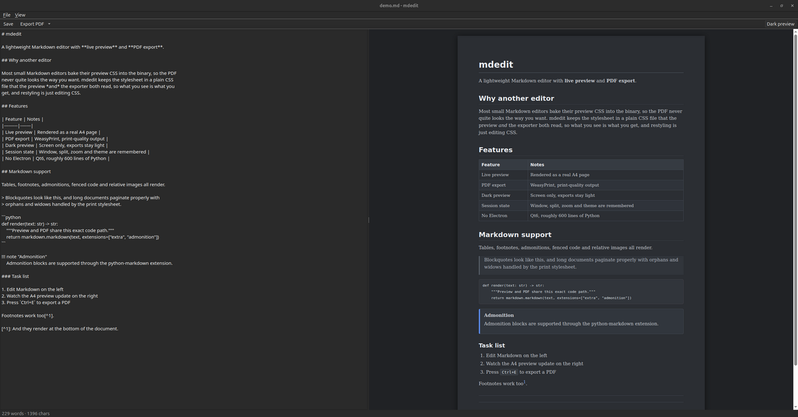

# mdedit

A lightweight Markdown editor and PDF exporter for Linux. Qt, not Electron.

Opens `.md` files, edits them with a live preview, and exports a clean A4 PDF
that looks exactly like the preview. The whole thing is about 600 lines of
Python and installs into `~/.local` without root.



## Why

Most lightweight Markdown editors hardcode their preview CSS inside the binary,
so you cannot make the PDF look the way you want. mdedit keeps the stylesheet in
a plain CSS file that both the preview and the PDF export read, so what you see
is genuinely what you get, and restyling is just editing CSS.

## Install

```sh
git clone https://github.com/MatCer/mdedit.git
cd mdedit
./install.sh
```

No root needed: it creates a self-contained virtualenv in
`~/.local/share/mdedit-venv` and puts two commands in `~/.local/bin`.

One-liner, if you would rather not keep the checkout:

```sh
git clone --depth 1 https://github.com/MatCer/mdedit.git /tmp/mdedit \
  && /tmp/mdedit/install.sh && rm -rf /tmp/mdedit
```

Then verify:

```sh
~/.local/share/md2pdf/install.sh --check
```

Requires Python 3.10+. On Linux the editor also needs `libxcb-cursor`, which the
installer vendors automatically on Debian/Ubuntu if your system lacks it.

## Use

```sh
mdedit notes.md        # editor with live preview
mdedit                 # empty buffer
mdedit ~/notes/        # folder in the sidebar
md2pdf notes.md        # -> notes.pdf, no GUI
md2pdf notes.md out.pdf
md2pdf --html notes.md # standalone HTML
md2pdf --template=acme notes.md  # use a design template
md2pdf --templates     # list installed templates
```

After install, `.md` files open in mdedit on double-click.

### Shortcuts

| | |
|---|---|
| `Ctrl+S` / `Ctrl+O` / `Ctrl+N` | save / open / new |
| `Ctrl+Shift+O` / `Ctrl+B` | open folder / toggle sidebar |
| `Ctrl+E` | export PDF |
| `Ctrl+Shift+E` | export HTML |
| `Ctrl+P` | toggle preview pane |
| `Ctrl+1` / `Ctrl+2` | Markdown / PDF preview tab |
| `Ctrl+D` | dark preview |
| `F11` / `Esc` | fullscreen / leave fullscreen |
| `Ctrl+` `+` / `-` / `0` | preview zoom |
| `F5` | refresh preview |
| `Ctrl+R` | reload stylesheet |

The preview has two tabs. **Markdown** (the default) is a plain readable
render. **PDF** is the real exported PDF, rendered in the background as you
type: A4 page breaks, template headers, footers and page numbers included.

`File > Open Folder` shows a sidebar with the folder's Markdown files; click one
to open it. Unsaved changes prompt before switching. Right-click for new
file/folder, rename (`F2`) and move to trash (`Del`); drag files onto a
subfolder to move them. Opened folders are kept as projects in the dropdown at
the top of the sidebar (`+` adds one, `−` removes it from the list).

The editor remembers the open folder, window size and position, maximized/fullscreen state, the
split ratio, preview zoom and the dark toggle.

Dark preview only affects the screen. Exported PDFs are always the light
document, byte for byte identical whether dark mode is on or off.

## Markdown support

CommonMark plus GitHub extensions: tables, task lists, strikethrough,
autolinks, footnotes and `> [!NOTE]` alerts. Also definition lists,
`!!! note` admonitions, relative images and Mermaid diagrams. Rendered by
[markdown-it-py](https://markdown-it-py.readthedocs.io/).

Lists behave as on GitHub: no blank line is needed before a list, and nested
items can be indented by 2 spaces.

A ` ```mermaid ` code block is drawn as a diagram in the preview, in exported
PDFs and in exported HTML. Export draws the diagrams in an offscreen QtWebEngine
page, so `md2pdf` needs the GUI dependencies for this; on a CLI-only install
the diagram source is printed instead. `install.sh` bundles mermaid.js, so this
works offline.

Force a page break in the PDF with `<div class="page-break"></div>`.

## Resource usage

Rough numbers from my own machine, measured as PSS on a 4-page document. Treat
them as indicative rather than a benchmark: they will vary with your desktop,
Qt build and document size.

| | RAM | CPU |
|---|---|---|
| Editor, idle | ~360 MB | ~0% |
| Editor, while typing | ~360 MB | ~2% of one core |
| `md2pdf` (CLI) | ~70 MB | ~1s per run, then exits |

For context, on the same machine and document, gnome-text-editor used ~130 MB
and ghostwriter ~220 MB.

The editor is not the lightest option, and that is a deliberate trade. Most of
that memory is QtWebEngine, the browser engine that renders the preview. It is
also what makes the preview and the PDF come out of the same renderer, so what
you see on screen is what lands in the file. Qt's built-in `QTextBrowser` would
cost roughly 60 MB instead, but it does not support the print CSS the exporter
relies on, so the preview would stop matching the output.

The CLI does not load Qt at all, so scripted exports stay cheap.

## Styling

`doc.css` is the document typography, shared by the preview and the PDF.
`page.css` is the A4 page geometry: margins, page size, page numbers.

Edit them in `~/.local/share/md2pdf/`, then hit `Ctrl+R` in the editor or just
re-run `md2pdf`. The preview derives its page margins from `page.css`, so the two
cannot drift apart.

### Design templates

The repo ships only the default look. Your own templates live locally, one
directory each:

```
~/.config/mdedit/templates/acme/
    style.css     # layered over the default doc.css + page.css
    logo.svg      # anything style.css references, by relative url()
```

A document picks one in its front matter; `md2pdf --template=NAME` overrides it.
The other keys become hidden `.meta-<key>` elements a template can put into the
page header or footer, and `title` also sets the PDF title:

```markdown
---
template: acme
title: Quarterly report
header: Finance / Q3
footer: Quarterly report | Internal
---
```

```css
/* style.css: show `header:` at the top of every page */
.markdown-body .meta-header { display: block; position: running(header); }
@page { @top-left { content: element(header); } }
```

The Markdown tab applies the template's typography; page headers and footers
show in the PDF tab and the export.

PDF rendering is [WeasyPrint](https://weasyprint.org/), so `@page` rules,
`break-inside`, orphans and widows all work as in a real print stylesheet.

## Uninstall

```sh
~/.local/share/md2pdf/install.sh --uninstall
```

## Credits

The document styling comes from the `md-to-pdf` tool in
[pdf_translator](https://github.com/MatCer/pdf_translator).

## License

MIT
